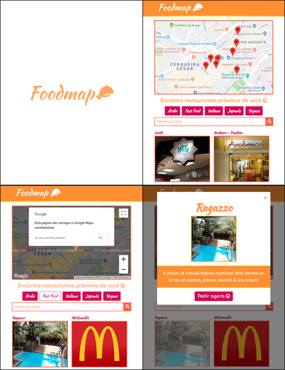

# Foodmap

## Motivo
Este é um desafio do Sprint 3 do bootcamp Laboratoria.

O desafio era ser possível localizar restaurantes específicos na região da Avenida Paulista, São Paulo - SP, usando a api da google maps.
A lista de restaurantes foi passada como um banco de dados interno.

## Aparência

